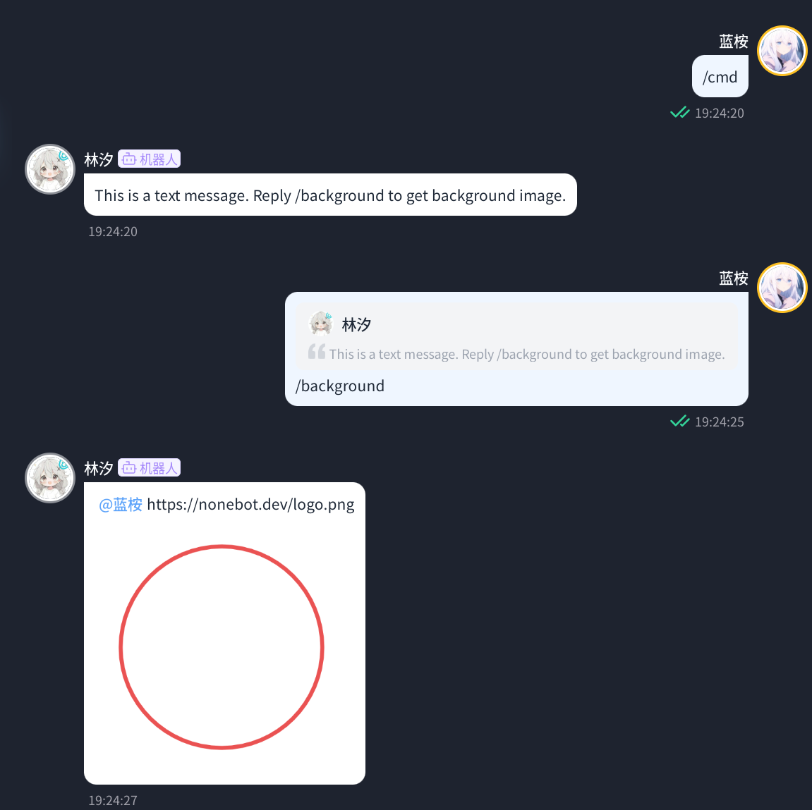

<!-- markdownlint-disable MD033 MD036 MD041 MD045 -->
<div align="center">
  <a href="https://v2.nonebot.dev/store">
    
  </a>

</div>

<div align="center">

# NoneBot-Plugin-Argot

_✨ NoneBot2 暗语消息 ✨_

<a href="">
  

<a href="https://pdm.fming.dev">
  
</a>
<a href="https://github.com/nonebot/plugin-alconna">
  
</a>
<br />
<a href="#-效果图">
  <strong>📸 演示与预览</strong>
</a>
&nbsp;&nbsp;|&nbsp;&nbsp;
<a href="#-安装">
  <strong>📦️ 下载插件</strong>
</a>
&nbsp;&nbsp;|&nbsp;&nbsp;
<a href="https://qm.qq.com/q/Vuipof2zug" target="__blank">
  <strong>💬 加入交流群</strong>
</a>

</div>

## 📖 介绍

NoneBot2 暗语消息

## 💿 安装

以下提到的方法任选 **其一** 即可

<details open>
<summary>[推荐] 使用 nb-cli 安装</summary>
在 Bot 的根目录下打开命令行, 输入以下指令即可安装

```bash
nb plugin install nonebot-plugin-argot
```

</details>
<details>
<summary>使用包管理器安装</summary>

```bash
pip install nonebot-plugin-argot
# or, use poetry
poetry add nonebot-plugin-argot
# or, use pdm
pdm add nonebot-plugin-argot
```

</details>

## ⚙️ 配置

|            配置项             | 必填 |              默认值             |
| :---------------------------: | :--: | :-----------------------------: |
|     argot\_\_url_to_image     |  否  |              True               |

## 🎉 使用

### 添加暗语

```py
# 无过期时间
await cmd.send(
    "This is a text message. Reply /background to get background image.",
    argot={
        "name": "background",
        "command": "background",
        "content": "https://nonebot.dev/logo.png",
    }
)

# 60s 后过期
await cmd.send(
    "This is a text message. Reply /background to get background image.",
    argot={
        "name": "background",
        "command": "background",
        "content": "https://nonebot.dev/logo.png",
        "expire": 60
    }
)

# 使用 Alconna UniMessage 
await (
    UniMessage.text("This is a text message. Reply /background to get background image.")
    .send(
        argot={
            "name": "background",
            "command": "background",
            "content": "https://koishi.chat/logo.png",
            "expire": 60
        }
    )
)
```

或者使用 `add_argot` 函数。
参数如下：
- `name`：名称（相当于 `content` 的 key）
- `content`：暗语内容
- `command`：用户响应指令（为 None 则无法响应）
- `expire`：过期时间（单位：秒；在 `add_argot` 函数中可传入 timedelta）

### 获取暗语信息

- 使用设置的 `command`
- 通过 `get_argot` 函数
- 超管回复暗语消息 `/argot [name]`
  
## 📸 效果图



## 💖 鸣谢

- [`KiramiBot`](https://github.com/A-kirami/KiramiBot)：灵感来源

## 📄 许可证

本项目使用 MIT 许可证开源

```txt
THE SOFTWARE IS PROVIDED "AS IS", WITHOUT WARRANTY OF ANY KIND, EXPRESS OR
IMPLIED, INCLUDING BUT NOT LIMITED TO THE WARRANTIES OF MERCHANTABILITY,
FITNESS FOR A PARTICULAR PURPOSE AND NONINFRINGEMENT. IN NO EVENT SHALL THE
AUTHORS OR COPYRIGHT HOLDERS BE LIABLE FOR ANY CLAIM, DAMAGES OR OTHER
LIABILITY, WHETHER IN AN ACTION OF CONTRACT, TORT OR OTHERWISE, ARISING FROM,
OUT OF OR IN CONNECTION WITH THE SOFTWARE OR THE USE OR OTHER DEALINGS IN THE
SOFTWARE.

```
